# Abstract

Zero-shot speaker adaptation aims to clone an unseen speaker's voice without any adaptation time and parameters. Previous researches usually use a speaker encoder to extract a global fixed speaker embedding from reference speech, and several attempts have tried variable-length speaker embedding. However, they neglect to transfer the personal pronunciation characteristics related to phoneme content, leading to poor speaker similarity in terms of detailed speaking styles and pronunciation habits. To improve the ability of the speaker encoder to model personal pronunciation characteristics, we propose content-dependent fine-grained speaker embedding for zero-shot speaker adaptation. The corresponding local content embeddings and speaker embeddings are extracted from a reference speech, respectively. Instead of modeling the temporal relations, a reference attention module is introduced to model the content relevance between the reference speech and the input text, and to generate the fine-grained speaker embedding for each phoneme encoder output. The experimental results show that our proposed method can improve speaker similarity of synthesized speeches, especially for unseen speakers.

    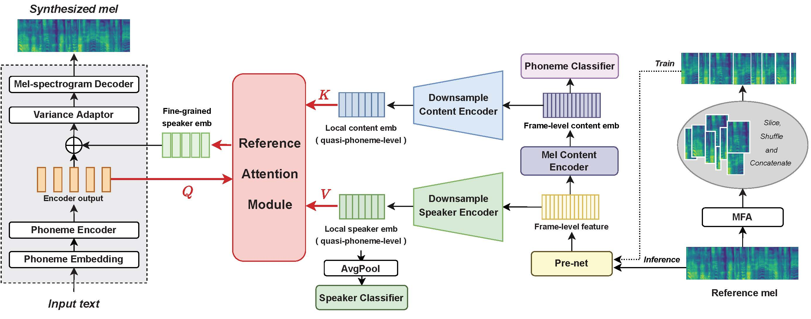
     
    
 Fig.1: The structure of the proposed model. 

# Subjective Evaluation  

To demonstrate that our proposed **CDFSE** method outperforms all three baselines in terms of speaker similarity. **GSE** denotes global speaker embedding method, **CLS** denotes jointly-trained speaker classifier method, and **Attentron\*** denotes attention-based variable-length embedding method, which are described in detail in the paper. In SpeakerID, **(S)** means **seen speaker** in the training set and **(US)** means **unseen speaker**.  A reference speech is provided for the only reference in this zero-shot task, thus we hope the synthesized speech is more similar to **the reference speech both in global timbre and local pronunciation variations (e.g., accent)**. 
*In addition, ground-truth (GT) samples are also provided for better comparison.*

| SpeakerID | Reference | Text | GSE | CLS | Attentron* | CDFSE | GT |
| :---- | :---- | :---- | :---- | :---- | :---- | :---- | :---- |
| SSB0631 (S) | <audio controls><source src="./wavs/Reference/SSB06310009.wav" type="audio/wav">Your browser does not support the audio element.</audio> | 九千九百五十七点四。  (jiu3 qian1 jiu2 bai3 wu3 shi2 qi1 dian3 si4 .) | <audio controls><source src="./wavs/GSE/SSB06310009.wav" type="audio/wav">Your browser does not support the audio element.</audio> | <audio controls><source src="./wavs/CLS/SSB06310009.wav" type="audio/wav">Your browser does not support the audio element.</audio> | <audio controls><source src="./wavs/Attentron/SSB06310009.wav" type="audio/wav">Your browser does not support the audio element.</audio> | <audio controls><source src="./wavs/CDFSE_16/SSB06310009.wav" type="audio/wav">Your browser does not support the audio element.</audio> | <audio controls><source src="./wavs/GT/SSB06310009.wav" type="audio/wav">Your browser does not support the audio element.</audio> |
| SSB1108 (S) | <audio controls><source src="./wavs/Reference/SSB11080012.wav" type="audio/wav">Your browser does not support the audio element.</audio> | 降幅收窄一个百分点。  (jiang4 fu2 shou1 zhai3 yi2 ge4 bai3 fen1 dian3 .) | <audio controls><source src="./wavs/GSE/SSB11080012.wav" type="audio/wav">Your browser does not support the audio element.</audio> | <audio controls><source src="./wavs/CLS/SSB11080012.wav" type="audio/wav">Your browser does not support the audio element.</audio> | <audio controls><source src="./wavs/Attentron/SSB11080012.wav" type="audio/wav">Your browser does not support the audio element.</audio> | <audio controls><source src="./wavs/CDFSE_16/SSB11080012.wav" type="audio/wav">Your browser does not support the audio element.</audio> | <audio controls><source src="./wavs/GT/SSB11080012.wav" type="audio/wav">Your browser does not support the audio element.</audio> |
| SSB1365 (S) | <audio controls><source src="./wavs/Reference/SSB13650004.wav" type="audio/wav">Your browser does not support the audio element.</audio> | 中国移动，临汝镇，营业厅。  (zhong1 guo2 yi2 dong4 , lin2 ru3 zhen4 , ying2 ye4 ting1 .) | <audio controls><source src="./wavs/GSE/SSB13650004.wav" type="audio/wav">Your browser does not support the audio element.</audio> | <audio controls><source src="./wavs/CLS/SSB13650004.wav" type="audio/wav">Your browser does not support the audio element.</audio> | <audio controls><source src="./wavs/Attentron/SSB13650004.wav" type="audio/wav">Your browser does not support the audio element.</audio> | <audio controls><source src="./wavs/CDFSE_16/SSB13650004.wav" type="audio/wav">Your browser does not support the audio element.</audio> | <audio controls><source src="./wavs/GT/SSB13650004.wav" type="audio/wav">Your browser does not support the audio element.</audio> |
| SSB0112 (US) | <audio controls><source src="./wavs/Reference/SSB01120002.wav" type="audio/wav">Your browser does not support the audio element.</audio> | 幺三三三七零八零七八七。  (yao1 san1 san1 san1 qi1 ling2 ba1 ling2 qi1 ba1 qi1 .) | <audio controls><source src="./wavs/GSE/SSB01120002.wav" type="audio/wav">Your browser does not support the audio element.</audio> | <audio controls><source src="./wavs/CLS/SSB01120002.wav" type="audio/wav">Your browser does not support the audio element.</audio> | <audio controls><source src="./wavs/Attentron/SSB01120002.wav" type="audio/wav">Your browser does not support the audio element.</audio> | <audio controls><source src="./wavs/CDFSE_16/SSB01120002.wav" type="audio/wav">Your browser does not support the audio element.</audio> | <audio controls><source src="./wavs/GT/SSB01120002.wav" type="audio/wav">Your browser does not support the audio element.</audio> |
| SSB0606 (US) | <audio controls><source src="./wavs/Reference/SSB06060009.wav" type="audio/wav">Your browser does not support the audio element.</audio> | 相关公司股票走势中航地产保利地产金融街。  (xiang1 guan1 gong1 si1 gu3 piao4 zou3 shi4 zhong1 hang2 di4 chan3 bao3 li4 di4 chan3 jin1 rong2 jie1 .) | <audio controls><source src="./wavs/GSE/SSB06060009.wav" type="audio/wav">Your browser does not support the audio element.</audio> | <audio controls><source src="./wavs/CLS/SSB06060009.wav" type="audio/wav">Your browser does not support the audio element.</audio> | <audio controls><source src="./wavs/Attentron/SSB06060009.wav" type="audio/wav">Your browser does not support the audio element.</audio> | <audio controls><source src="./wavs/CDFSE_16/SSB06060009.wav" type="audio/wav">Your browser does not support the audio element.</audio> | <audio controls><source src="./wavs/GT/SSB06060009.wav" type="audio/wav">Your browser does not support the audio element.</audio> |
| SSB0710 (US) | <audio controls><source src="./wavs/Reference/SSB07100005.wav" type="audio/wav">Your browser does not support the audio element.</audio> | **而**且杂志也没被那个超级粉丝展示出来。  (**er2** qie3 za2 zhi4 ye3 mei2 bei4 na4 ge4 chao1 ji2 fen3 si1 zhan3 shi4 chu1 lai2 .) | <audio controls><source src="./wavs/GSE/SSB07100005.wav" type="audio/wav">Your browser does not support the audio element.</audio> | <audio controls><source src="./wavs/CLS/SSB07100005.wav" type="audio/wav">Your browser does not support the audio element.</audio> | <audio controls><source src="./wavs/Attentron/SSB07100005.wav" type="audio/wav">Your browser does not support the audio element.</audio> | <audio controls><source src="./wavs/CDFSE_16/SSB07100005.wav" type="audio/wav">Your browser does not support the audio element.</audio> | <audio controls><source src="./wavs/GT/SSB07100005.wav" type="audio/wav">Your browser does not support the audio element.</audio> |
| SSB1020 (US) | <audio controls><source src="./wavs/Reference/SSB10200009.wav" type="audio/wav">Your browser does not support the audio element.</audio> | 将依据发行人的信息披露文件进行独立的投资判断。  (jiang1 yi1 ju4 fa1 xing2 ren2 de5 xin4 xi1 pi1 lou4 wen2 jian4 jin4 xing2 du2 li4 de5 tou2 zi1 pan4 duan4 .) | <audio controls><source src="./wavs/GSE/SSB10200009.wav" type="audio/wav">Your browser does not support the audio element.</audio> | <audio controls><source src="./wavs/CLS/SSB10200009.wav" type="audio/wav">Your browser does not support the audio element.</audio> | <audio controls><source src="./wavs/Attentron/SSB10200009.wav" type="audio/wav">Your browser does not support the audio element.</audio> | <audio controls><source src="./wavs/CDFSE_16/SSB10200009.wav" type="audio/wav">Your browser does not support the audio element.</audio> | <audio controls><source src="./wavs/GT/SSB10200009.wav" type="audio/wav">Your browser does not support the audio element.</audio> |
| SSB1782 (US) | <audio controls><source src="./wavs/Reference/SSB17820006.wav" type="audio/wav">Your browser does not support the audio element.</audio> | 我要知道那天发生的每一件事。  (wo3 yao4 zhi1 dao4 na4 tian1 fa1 sheng1 de5 mei3 yi2 jian4 shi4 .) | <audio controls><source src="./wavs/GSE/SSB17820006.wav" type="audio/wav">Your browser does not support the audio element.</audio> | <audio controls><source src="./wavs/CLS/SSB17820006_.wav" type="audio/wav">Your browser does not support the audio element.</audio> | <audio controls><source src="./wavs/Attentron/SSB17820006.wav" type="audio/wav">Your browser does not support the audio element.</audio> | <audio controls><source src="./wavs/CDFSE_16/SSB17820006.wav" type="audio/wav">Your browser does not support the audio element.</audio> | <audio controls><source src="./wavs/GT/SSB17820006.wav" type="audio/wav">Your browser does not support the audio element.</audio> |

* * *

# Ablation Study 

### 1. Investigation on local speaker embeddings with different granularity 

To investigate the impact of local speaker embeddings with different granularity, we adjust the kernel size of average pooling layer in the downsample encoder. The number after 'CDFSE-' represents the **overall downsampling times in temporal** compared with the reference mel-spectrogram. Our proposed method is **CDFSE-16**. With the decrease of downsampling times, the mispronunciation rate of synthesized speech increases significantly.

| SpeakerID | Reference | Text | CDFSE-1 | CDFSE-4 | CDFSE-16 | CDFSE-64 | GT |
| :---- | :---- | :---- | :---- | :---- | :---- | :---- | :---- |
| SSB0393 (US) | <audio controls><source src="./wavs/Reference/SSB03930007.wav" type="audio/wav">Your browser does not support the audio element.</audio> | 看来我现在是个真正的作家了。  (kan4 lai2 wo3 xian4 zai4 shi4 ge4 zhen1 zheng4 de5 zuo4 jia1 le5 .)  | <audio controls><source src="./wavs/CDFSE_01/SSB03930007.wav" type="audio/wav">Your browser does not support the audio element.</audio> | <audio controls><source src="./wavs/CDFSE_04/SSB03930007.wav" type="audio/wav">Your browser does not support the audio element.</audio> | <audio controls><source src="./wavs/CDFSE_16/SSB03930007.wav" type="audio/wav">Your browser does not support the audio element.</audio> | <audio controls><source src="./wavs/CDFSE_64/SSB03930007.wav" type="audio/wav">Your browser does not support the audio element.</audio> | <audio controls><source src="./wavs/GT/SSB03930007.wav" type="audio/wav">Your browser does not support the audio element.</audio> |
| SSB0606 (US) | <audio controls><source src="./wavs/Reference/SSB06060006.wav" type="audio/wav">Your browser does not support the audio element.</audio> | 要完整呈现家人的实时健康状态。  (yao4 wan2 zheng2 cheng2 xian4 jia1 ren2 de5 shi2 shi2 jian4 kang1 zhuang4 tai4 .) | <audio controls><source src="./wavs/CDFSE_01/SSB06060006.wav" type="audio/wav">Your browser does not support the audio element.</audio> | <audio controls><source src="./wavs/CDFSE_04/SSB06060006.wav" type="audio/wav">Your browser does not support the audio element.</audio> | <audio controls><source src="./wavs/CDFSE_16/SSB06060006.wav" type="audio/wav">Your browser does not support the audio element.</audio> | <audio controls><source src="./wavs/CDFSE_64/SSB06060006.wav" type="audio/wav">Your browser does not support the audio element.</audio> | <audio controls><source src="./wavs/GT/SSB06060006.wav" type="audio/wav">Your browser does not support the audio element.</audio> |

### 2. Investigation on Speaker Classification Loss

We remove the explicit supervision of local speaker embedding by excluding speaker classification loss, and find it will cause the decline of speaker similarity and synthesis stability.

| SpeakerID | Reference | Text | w SpkCls | w/o SpkCls | GT |
| :---- | :---- | :---- | :---- | :---- | :---- |
| SSB0393 (US) | <audio controls><source src="./wavs/Reference/SSB03930010.wav" type="audio/wav">Your browser does not support the audio element.</audio> | 并和同学旁边的乘客换了座位。  (bing4 he2 tong2 xue2 pang2 bian1 de5 cheng2 ke4 huan4 le5 zuo4 wei3 .) | <audio controls><source src="./wavs/CDFSE_16/SSB03930010.wav" type="audio/wav">Your browser does not support the audio element.</audio> | <audio controls><source src="./wavs/CDFSE_16_wospk/SSB03930010.wav" type="audio/wav">Your browser does not support the audio element.</audio> | <audio controls><source src="./wavs/GT/SSB03930010.wav" type="audio/wav">Your browser does not support the audio element.</audio> |
| SSB1935 (US) | <audio controls><source src="./wavs/Reference/SSB19350006.wav" type="audio/wav">Your browser does not support the audio element.</audio> |  是为拉高股价所做的奋力一搏。  (shi4 wei4 la1 gao1 gu3 jia4 suo3 zuo4 de5 fen4 li4 yi4 bo2 .)  | <audio controls><source src="./wavs/CDFSE_16/SSB19350006.wav" type="audio/wav">Your browser does not support the audio element.</audio> | <audio controls><source src="./wavs/CDFSE_16_wospk/SSB19350006.wav" type="audio/wav">Your browser does not support the audio element.</audio> | <audio controls><source src="./wavs/GT/SSB19350006.wav" type="audio/wav">Your browser does not support the audio element.</audio> |

### 3. Investigation on Phoneme Classification Loss

We remove the explicit supervision of local content embedding by excluding phoneme classification loss, and find it will cause the reference attention module fail and lose the ability to transfer personal pronunciation characteristics.

| SpeakerID | Reference | Text | w PhnCls | w/o PhnCls | GT |
| :---- | :---- | :---- | :---- | :---- | :---- |
| SSB0606 (US) | <audio controls><source src="./wavs/Reference/SSB06060009.wav" type="audio/wav">Your browser does not support the audio element.</audio> | 相关公司股票走势中航地产保利地产金融街。  (xiang1 guan1 gong1 si1 gu3 piao4 zou3 shi4 zhong1 hang2 di4 chan3 bao3 li4 di4 chan3 jin1 rong2 jie1 .) | <audio controls><source src="./wavs/CDFSE_16/SSB06060009.wav" type="audio/wav">Your browser does not support the audio element.</audio> 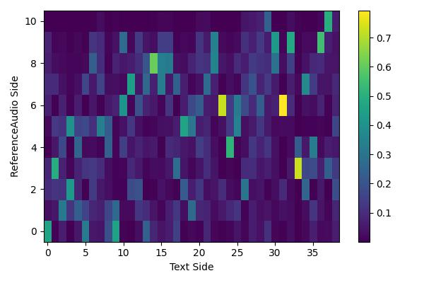 | <audio controls><source src="./wavs/CDFSE_16_wocon/SSB06060009.wav" type="audio/wav">Your browser does not support the audio element.</audio> 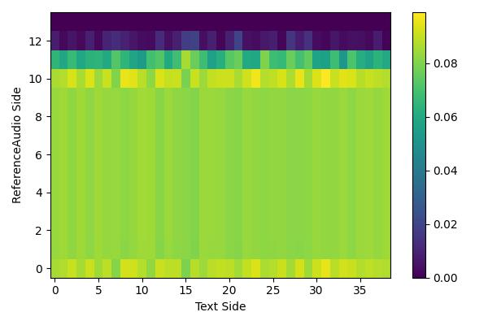 | <audio controls><source src="./wavs/GT/SSB06060009.wav" type="audio/wav">Your browser does not support the audio element.</audio> |
| SSB1020 (US) | <audio controls><source src="./wavs/Reference/SSB10200004.wav" type="audio/wav">Your browser does not support the audio element.</audio> | 无论是在喜临门地标还是左右。  (wu2 lun4 shi4 zai4 xi3 lin2 men2 di4 biao1 hai2 shi4 zuo3 you4 .)  | <audio controls><source src="./wavs/CDFSE_16/SSB10200004.wav" type="audio/wav">Your browser does not support the audio element.</audio> 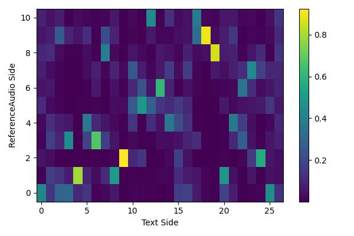 | <audio controls><source src="./wavs/CDFSE_16_wocon/SSB10200004.wav" type="audio/wav">Your browser does not support the audio element.</audio> 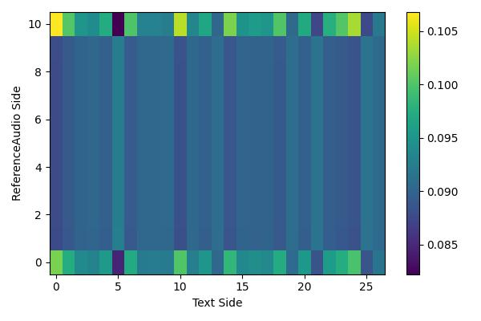 | <audio controls><source src="./wavs/GT/SSB10200004.wav" type="audio/wav">Your browser does not support the audio element.</audio> |

### 4. Investigation on preprocessing operations

We also remove the preprocessing operations (slice, shuffle & concatenate) mentioned in the paper 2.3 during training, and find it will result in synthesized speech with strange prosody and poor intelligibility.

| SpeakerID | Reference | Text | w preprocessing | w/o preprocessing | GT |
| :---- | :---- | :---- | :---- | :---- | :---- |
| SSB0393 | <audio controls><source src="./wavs/Reference/SSB03930007.wav" type="audio/wav">Your browser does not support the audio element.</audio> | 看来我现在是个真正的作家了。  (kan4 lai2 wo3 xian4 zai4 shi4 ge4 zhen1 zheng4 de5 zuo4 jia1 le5 .) | <audio controls><source src="./wavs/CDFSE_16/SSB03930007.wav" type="audio/wav">Your browser does not support the audio element.</audio> 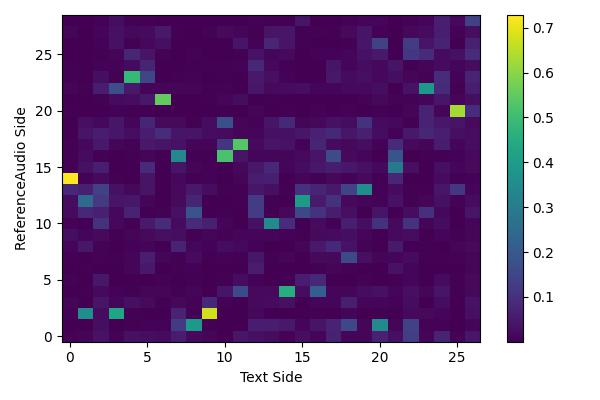 | <audio controls><source src="./wavs/CDFSE_16_woshuffle/SSB03930007.wav" type="audio/wav">Your browser does not support the audio element.</audio> 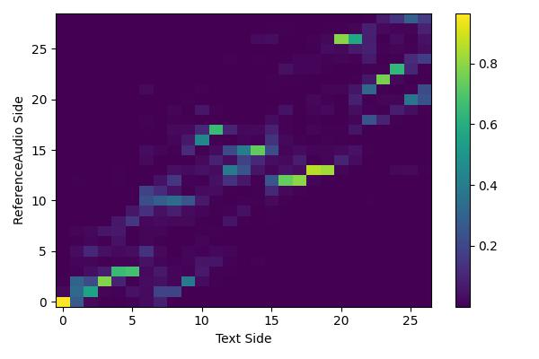 | <audio controls><source src="./wavs/GT/SSB03930007.wav" type="audio/wav">Your browser does not support the audio element.</audio> |
| SSB0606 | <audio controls><source src="./wavs/Reference/SSB06060006.wav" type="audio/wav">Your browser does not support the audio element.</audio> | 要完整呈现家人的实时健康状态。  (yao4 wan2 zheng2 cheng2 xian4 jia1 ren2 de5 shi2 shi2 jian4 kang1 zhuang4 tai4 .)  | <audio controls><source src="./wavs/CDFSE_16/SSB06060006.wav" type="audio/wav">Your browser does not support the audio element.</audio> 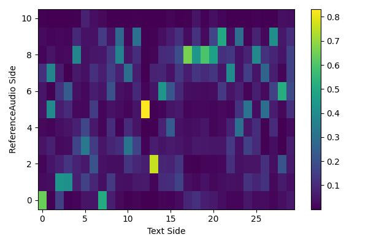 | <audio controls><source src="./wavs/CDFSE_16_woshuffle/SSB06060006.wav" type="audio/wav">Your browser does not support the audio element.</audio> 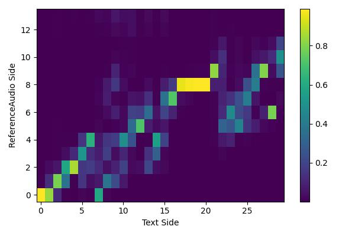 | <audio controls><source src="./wavs/GT/SSB06060006.wav" type="audio/wav">Your browser does not support the audio element.</audio> |

* * *

# Analysis and Discussion

### Alignment about content relevance

We have plotted some alignment samples from reference attention module of CDFSE. It can be observed that the reference attention module successfully learns the right content alignment between reference audio and text, providing the interpretability of our proposed method.

##### An alignment example in CDFSE.

**Reference Speech Side**: 来几首法语歌儿。（lai2 ji2 shou3 fa2 yv3 ge1 rr .）

<audio controls><source src="./wavs/Reference/SSB16300026.wav" type="audio/wav">Your browser does not support the audio element.</audio>

**Input Text Side**: 反而进一步提升了他个人在海内外的知名度。 (fan3 er2 jin4 yi2 bu4 ti2 sheng1 le5 ta1 ge4 ren2 zai4 hai3 nei4 wai4 de5 zhi1 ming2 du4 .)

**Synthesized Speech**: 

<audio controls><source src="./wavs/CDFSE_16/SSB16300026.wav" type="audio/wav">Your browser does not support the audio element.</audio>

    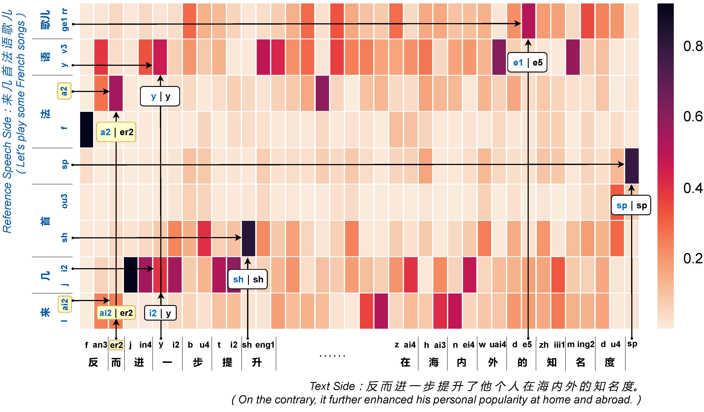
     
    
 Fig.2: An alignment example in CDFSE. 

##### Compared with Attentron\*.

For comparison, another case with specific-designed input text is given, presenting alignments from CDFSE and the attention mechanism in Attentron\*. 
*The input text is designed to first repeat the content of the reference speech and then reverse it at the Chinese character level.*

**Reference Speech Side**: 仅在与之利益密切相关的特定事项上，享有表决权。（jin3 zai4 yu3 zhi1 li4 yi4 mi4 qie4 xiang1 guan1 de5 te4 ding4 shi4 xiang4 shang4 , xiang2 you2 biao3 jue2 quan2 .）

<audio controls><source src="./wavs/Reference/SSB03930007.wav" type="audio/wav">Your browser does not support the audio element.</audio>

**Input Text Side**: 仅在与之利益密切相关的特定事项上，享有表决权。权决表有享，上项事定特的关相切密益利之与在仅。 (jin3 zai4 yu3 zhi1 li4 yi4 mi4 qie4 xiang1 guan1 de5 te4 ding4 shi4 xiang4 shang4 , xiang2 you2 biao3 jue2 quan2 . quan2 jue2 biao3 you2 xiang2 , shang4 xiang4 shi4 ding4 te4 de5 guan1 xiang1 qie4 mi4 yi4 li4 zhi1 yu3 zai4 jin3 .)

**Synthesized Speech of Attentron\***: 

<audio controls><source src="./wavs/casestudy/Attentron.wav" type="audio/wav">Your browser does not support the audio element.</audio>

    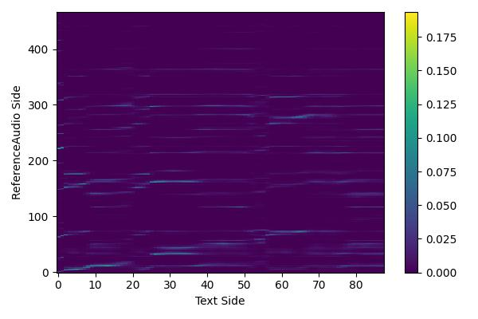
     
    
 Fig.3 (a): Alignment in Attentron*. 

**Synthesized Speech of CDFSE**: 

<audio controls><source src="./wavs/casestudy/CDFSE.wav" type="audio/wav">Your browser does not support the audio element.</audio>

    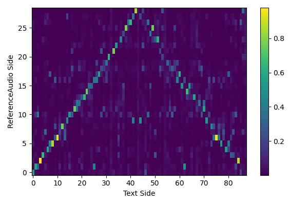
     
    
 Fig.3 (b): Alignment in CDFSE. 

### Visualization of speaker embeddings

We further visualize the fine-grained speaker embeddings by 2D t-SNE. As shown in Fig.4, the fine-grained speaker embeddings of the same speaker tend to group together while exhibiting certain content dependent diversities.

    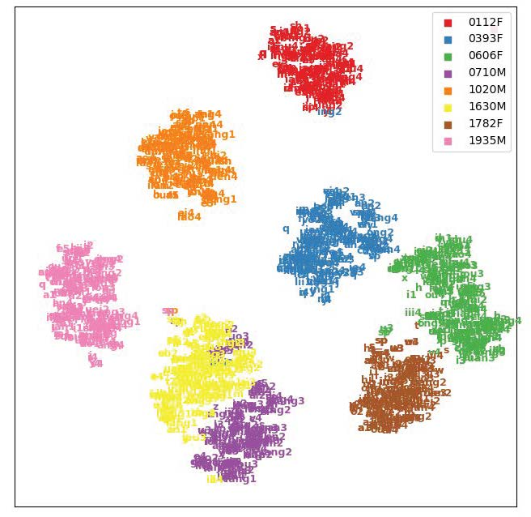
     
    
 Fig.4: T-SNE visualization of content-dependent fine-grained speaker embeddings. 

