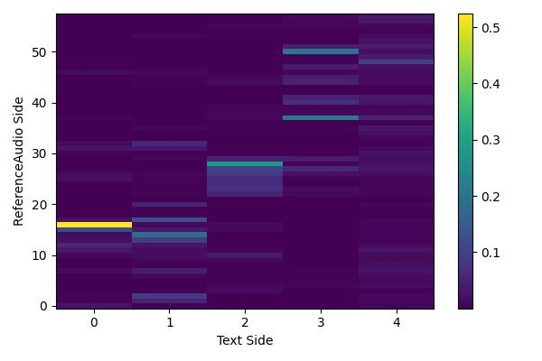
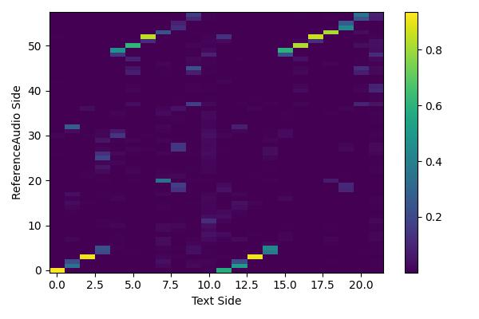
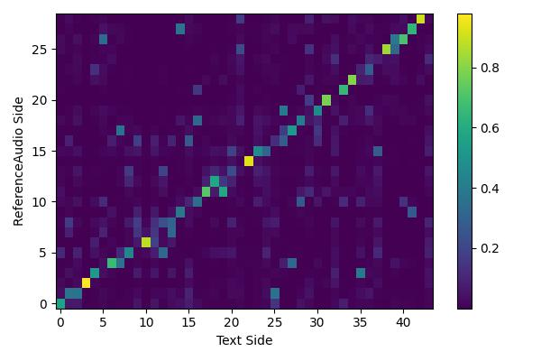
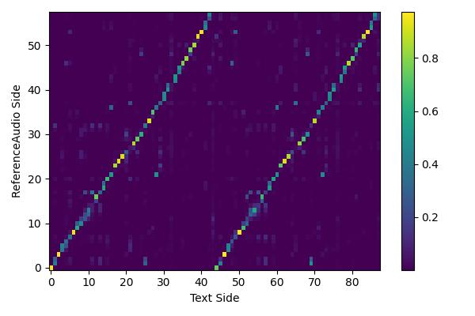
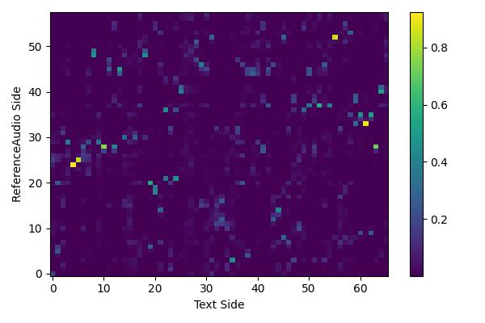
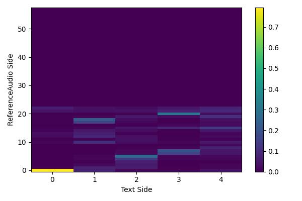
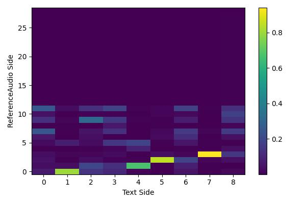
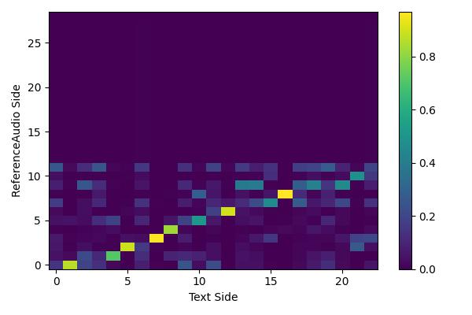
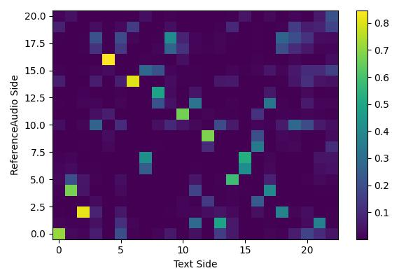
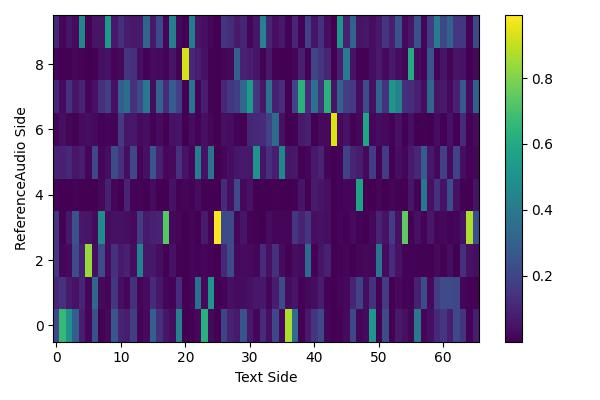

# Abstract

Zero-shot speaker adaptation aims to clone an unseen speaker's voice without any adaptation time and parameters. Previous researches usually use a speaker encoder to extract a global fixed speaker embedding from reference speech, and several attempts have tried variable-length speaker embedding. However, they neglect to transfer the personal pronunciation characteristics related to phoneme content, leading to poor speaker similarity in terms of detailed speaking styles and pronunciation habits. To improve the ability of the speaker encoder to model personal pronunciation characteristics, we propose content-dependent fine-grained speaker embedding for zero-shot speaker adaptation. The corresponding local content embeddings and speaker embeddings are extracted from a reference speech, respectively. Instead of modeling the temporal relations, a reference attention module is introduced to model the content relevance between the reference speech and the input text, and to generate the fine-grained speaker embedding for each phoneme encoder output. The experimental results show that our proposed method can improve speaker similarity of synthesized speeches, especially for unseen speakers.

# Subjective Evaluation  
To demonstrate that our proposed **CDFSE** method outperforms all three baselines in terms of speaker similarity. **GSE** denotes global speaker embedding method, **CLS** denotes jointly-trained speaker classifier method, and __Attentron*__ denotes attention-based variable-length embedding method, which are described in detail in the paper. In SpeakerID, **(S)** means **seen speaker** in the training set and **(US)** means **unseen speaker**.  A reference speech is provided for the only reference in this zero-shot task, thus we hope the synthesized speech is more similar to **the reference speech both in global timbre and local pronunciation variations**. 
*In addition, ground-truth (GT) samples are also provided for better comparison.*

| SpeakerID | Reference | Text | GSE | CLS | Attentron* | CDFSE | GT |
| :---- | :---- | :---- | :---- | :---- | :---- | :---- | :---- |
| SSB0011 (S) | <audio controls><source src="./wavs/Reference/SSB00110003.wav" type="audio/wav">Your browser does not support the audio element.</audio> | 基层医院的医生缺乏不断学习和提高水平的动力。  (ji1 ceng2 yi1 yuan4 de5 yi1 sheng1 que1 fa2 bu2 duan4 xue2 xi2 he2 ti2 gao1 shui3 ping2 de5 dong4 li4 .) | <audio controls><source src="./wavs/GSE/SSB00110003.wav" type="audio/wav">Your browser does not support the audio element.</audio> | <audio controls><source src="./wavs/CLS/SSB00110003.wav" type="audio/wav">Your browser does not support the audio element.</audio> | <audio controls><source src="./wavs/Attentron/SSB00110003.wav" type="audio/wav">Your browser does not support the audio element.</audio> | <audio controls><source src="./wavs/CDFSE_16/SSB00110003.wav" type="audio/wav">Your browser does not support the audio element.</audio> | <audio controls><source src="./wavs/GT/SSB00110003.wav" type="audio/wav">Your browser does not support the audio element.</audio> |
| SSB0631 (S) | <audio controls><source src="./wavs/Reference/SSB06310009.wav" type="audio/wav">Your browser does not support the audio element.</audio> | 九千九百五十七点四。  (jiu3 qian1 jiu2 bai3 wu3 shi2 qi1 dian3 si4 .) | <audio controls><source src="./wavs/GSE/SSB06310009.wav" type="audio/wav">Your browser does not support the audio element.</audio> | <audio controls><source src="./wavs/CLS/SSB06310009.wav" type="audio/wav">Your browser does not support the audio element.</audio> | <audio controls><source src="./wavs/Attentron/SSB06310009.wav" type="audio/wav">Your browser does not support the audio element.</audio> | <audio controls><source src="./wavs/CDFSE_16/SSB06310009.wav" type="audio/wav">Your browser does not support the audio element.</audio> | <audio controls><source src="./wavs/GT/SSB06310009.wav" type="audio/wav">Your browser does not support the audio element.</audio> |
| SSB1108 (S) | <audio controls><source src="./wavs/Reference/SSB11080012.wav" type="audio/wav">Your browser does not support the audio element.</audio> | 降幅收窄一个百分点。  (jiang4 fu2 shou1 zhai3 yi2 ge4 bai3 fen1 dian3 .) | <audio controls><source src="./wavs/GSE/SSB11080012.wav" type="audio/wav">Your browser does not support the audio element.</audio> | <audio controls><source src="./wavs/CLS/SSB11080012.wav" type="audio/wav">Your browser does not support the audio element.</audio> | <audio controls><source src="./wavs/Attentron/SSB11080012.wav" type="audio/wav">Your browser does not support the audio element.</audio> | <audio controls><source src="./wavs/CDFSE_16/SSB11080012.wav" type="audio/wav">Your browser does not support the audio element.</audio> | <audio controls><source src="./wavs/GT/SSB11080012.wav" type="audio/wav">Your browser does not support the audio element.</audio> |
| SSB1365 (S) | <audio controls><source src="./wavs/Reference/SSB13650004.wav" type="audio/wav">Your browser does not support the audio element.</audio> | 中国移动，临汝镇，营业厅。  (zhong1 guo2 yi2 dong4 , lin2 ru3 zhen4 , ying2 ye4 ting1 .) | <audio controls><source src="./wavs/GSE/SSB13650004.wav" type="audio/wav">Your browser does not support the audio element.</audio> | <audio controls><source src="./wavs/CLS/SSB13650004.wav" type="audio/wav">Your browser does not support the audio element.</audio> | <audio controls><source src="./wavs/Attentron/SSB13650004.wav" type="audio/wav">Your browser does not support the audio element.</audio> | <audio controls><source src="./wavs/CDFSE_16/SSB13650004.wav" type="audio/wav">Your browser does not support the audio element.</audio> | <audio controls><source src="./wavs/GT/SSB13650004.wav" type="audio/wav">Your browser does not support the audio element.</audio> |
| SSB0112 (US) | <audio controls><source src="./wavs/Reference/SSB01120002.wav" type="audio/wav">Your browser does not support the audio element.</audio> | 幺三三三七零八零七八七。  (yao1 san1 san1 san1 qi1 ling2 ba1 ling2 qi1 ba1 qi1 .) | <audio controls><source src="./wavs/GSE/SSB01120002.wav" type="audio/wav">Your browser does not support the audio element.</audio> | <audio controls><source src="./wavs/CLS/SSB01120002.wav" type="audio/wav">Your browser does not support the audio element.</audio> | <audio controls><source src="./wavs/Attentron/SSB01120002.wav" type="audio/wav">Your browser does not support the audio element.</audio> | <audio controls><source src="./wavs/CDFSE_16/SSB01120002.wav" type="audio/wav">Your browser does not support the audio element.</audio> | <audio controls><source src="./wavs/GT/SSB01120002.wav" type="audio/wav">Your browser does not support the audio element.</audio> |
| SSB0606 (US) | <audio controls><source src="./wavs/Reference/SSB06060009.wav" type="audio/wav">Your browser does not support the audio element.</audio> | 相关公司股票走势中航地产保利地产金融街。  (xiang1 guan1 gong1 si1 gu3 piao4 zou3 shi4 zhong1 hang2 di4 chan3 bao3 li4 di4 chan3 jin1 rong2 jie1 .) | <audio controls><source src="./wavs/GSE/SSB06060009.wav" type="audio/wav">Your browser does not support the audio element.</audio> | <audio controls><source src="./wavs/CLS/SSB06060009.wav" type="audio/wav">Your browser does not support the audio element.</audio> | <audio controls><source src="./wavs/Attentron/SSB06060009.wav" type="audio/wav">Your browser does not support the audio element.</audio> | <audio controls><source src="./wavs/CDFSE_16/SSB06060009.wav" type="audio/wav">Your browser does not support the audio element.</audio> | <audio controls><source src="./wavs/GT/SSB06060009.wav" type="audio/wav">Your browser does not support the audio element.</audio> |
| SSB0710 (US) | <audio controls><source src="./wavs/Reference/SSB07100005.wav" type="audio/wav">Your browser does not support the audio element.</audio> | 而且杂志也没被那个超级粉丝展示出来。  (er2 qie3 za2 zhi4 ye3 mei2 bei4 na4 ge4 chao1 ji2 fen3 si1 zhan3 shi4 chu1 lai2 .) | <audio controls><source src="./wavs/GSE/SSB07100005.wav" type="audio/wav">Your browser does not support the audio element.</audio> | <audio controls><source src="./wavs/CLS/SSB07100005.wav" type="audio/wav">Your browser does not support the audio element.</audio> | <audio controls><source src="./wavs/Attentron/SSB07100005.wav" type="audio/wav">Your browser does not support the audio element.</audio> | <audio controls><source src="./wavs/CDFSE_16/SSB07100005.wav" type="audio/wav">Your browser does not support the audio element.</audio> | <audio controls><source src="./wavs/GT/SSB07100005.wav" type="audio/wav">Your browser does not support the audio element.</audio> |
| SSB1020 (US) | <audio controls><source src="./wavs/Reference/SSB10200009.wav" type="audio/wav">Your browser does not support the audio element.</audio> | 将依据发行人的信息披露文件进行独立的投资判断。  (jiang1 yi1 ju4 fa1 xing2 ren2 de5 xin4 xi1 pi1 lou4 wen2 jian4 jin4 xing2 du2 li4 de5 tou2 zi1 pan4 duan4 .) | <audio controls><source src="./wavs/GSE/SSB10200009.wav" type="audio/wav">Your browser does not support the audio element.</audio> | <audio controls><source src="./wavs/CLS/SSB10200009.wav" type="audio/wav">Your browser does not support the audio element.</audio> | <audio controls><source src="./wavs/Attentron/SSB10200009.wav" type="audio/wav">Your browser does not support the audio element.</audio> | <audio controls><source src="./wavs/CDFSE_16/SSB10200009.wav" type="audio/wav">Your browser does not support the audio element.</audio> | <audio controls><source src="./wavs/GT/SSB10200009.wav" type="audio/wav">Your browser does not support the audio element.</audio> |
| SSB1782 (US) | <audio controls><source src="./wavs/Reference/SSB17820006.wav" type="audio/wav">Your browser does not support the audio element.</audio> | 我要知道那天发生的每一件事。  (wo3 yao4 zhi1 dao4 na4 tian1 fa1 sheng1 de5 mei3 yi2 jian4 shi4 .) | <audio controls><source src="./wavs/GSE/SSB17820006.wav" type="audio/wav">Your browser does not support the audio element.</audio> | <audio controls><source src="./wavs/CLS/SSB17820006_.wav" type="audio/wav">Your browser does not support the audio element.</audio> | <audio controls><source src="./wavs/Attentron/SSB17820006.wav" type="audio/wav">Your browser does not support the audio element.</audio> | <audio controls><source src="./wavs/CDFSE_16/SSB17820006.wav" type="audio/wav">Your browser does not support the audio element.</audio> | <audio controls><source src="./wavs/GT/SSB17820006.wav" type="audio/wav">Your browser does not support the audio element.</audio> |
| SSB1935 (US) | <audio controls><source src="./wavs/Reference/SSB19350010.wav" type="audio/wav">Your browser does not support the audio element.</audio> | 如公共场所儿基础设施部署不积极。  (ru2 gong1 gong4 chang2 suor3 ji1 chu3 she4 shi1 bu4 shu3 bu4 ji1 ji2 .) | <audio controls><source src="./wavs/GSE/SSB19350010.wav" type="audio/wav">Your browser does not support the audio element.</audio> | <audio controls><source src="./wavs/CLS/SSB19350010.wav" type="audio/wav">Your browser does not support the audio element.</audio> | <audio controls><source src="./wavs/Attentron/SSB19350010.wav" type="audio/wav">Your browser does not support the audio element.</audio> | <audio controls><source src="./wavs/CDFSE_16/SSB19350010.wav" type="audio/wav">Your browser does not support the audio element.</audio> | <audio controls><source src="./wavs/GT/SSB19350010.wav" type="audio/wav">Your browser does not support the audio element.</audio> |

* * *

# Ablation Study 
### Investigation on speaker embeddings with different granularity 
To investigate the impact of local speaker embeddings with different granularity, we adjust the kernel size of average pooling layer in the downsample encoder. The number after CDFSE- represents the **overall downsampling times** in the temporal resolution compared with the reference mel-spectrogram. It can be observed that, with smaller downsampling times, more fine-grained local speaker embeddings can be extracted from reference audio, which can improve speaker similarity but result in deterioration of intelligibility.

| SpeakerID | Reference | Text | CDFSE-1 | CDFSE-4 | CDFSE-16 | CDFSE-64 |
| :---- | :---- | :---- | :---- | :---- | :---- | :---- |
| SSB0112 | <audio controls><source src="./wavs/reference/SSB01120001.wav" type="audio/wav">Your browser does not support the audio element.</audio> | 一三三三七零八零七八七。 | <audio controls><source src="./wavs/cdfse-1/SSB01120002.wav" type="audio/wav">Your browser does not support the audio element.</audio> | <audio controls><source src="./wavs/cdfse-4/SSB01120002.wav" type="audio/wav">Your browser does not support the audio element.</audio> | <audio controls><source src="./wavs/cdfse-16/SSB01120002.wav" type="audio/wav">Your browser does not support the audio element.</audio> | <audio controls><source src="./wavs/cdfse-64/SSB01120002.wav" type="audio/wav">Your browser does not support the audio element.</audio> |
| SSB0393 | <audio controls><source src="./wavs/reference/SSB03930001.wav" type="audio/wav">Your browser does not support the audio element.</audio> | 如新兴区域的望京奥运村地区。 | <audio controls><source src="./wavs/cdfse-1/SSB03930005.wav" type="audio/wav">Your browser does not support the audio element.</audio> | <audio controls><source src="./wavs/cdfse-4/SSB03930005.wav" type="audio/wav">Your browser does not support the audio element.</audio> | <audio controls><source src="./wavs/cdfse-16/SSB03930005.wav" type="audio/wav">Your browser does not support the audio element.</audio> | <audio controls><source src="./wavs/cdfse-64/SSB03930005.wav" type="audio/wav">Your browser does not support the audio element.</audio> |
| SSB0710 | <audio controls><source src="./wavs/reference/SSB07100001.wav" type="audio/wav">Your browser does not support the audio element.</audio> | 甜心特工国语版。 | <audio controls><source src="./wavs/cdfse-1/SSB07100001.wav" type="audio/wav">Your browser does not support the audio element.</audio> | <audio controls><source src="./wavs/cdfse-4/SSB07100001.wav" type="audio/wav">Your browser does not support the audio element.</audio> | <audio controls><source src="./wavs/cdfse-16/SSB07100001.wav" type="audio/wav">Your browser does not support the audio element.</audio> | <audio controls><source src="./wavs/cdfse-64/SSB07100001.wav" type="audio/wav">Your browser does not support the audio element.</audio> |
| SSB1020 | <audio controls><source src="./wavs/reference/SSB10200001.wav" type="audio/wav">Your browser does not support the audio element.</audio> | 将依据发行人的信息披露文件进行独立的投资判断。 | <audio controls><source src="./wavs/cdfse-1/SSB10200009.wav" type="audio/wav">Your browser does not support the audio element.</audio> | <audio controls><source src="./wavs/cdfse-4/SSB10200009.wav" type="audio/wav">Your browser does not support the audio element.</audio> | <audio controls><source src="./wavs/cdfse-16/SSB10200009.wav" type="audio/wav">Your browser does not support the audio element.</audio> | <audio controls><source src="./wavs/cdfse-64/SSB10200009.wav" type="audio/wav">Your browser does not support the audio element.</audio> |
| SSB1630 | <audio controls><source src="./wavs/reference/SSB16300375.wav" type="audio/wav">Your browser does not support the audio element.</audio> | 广州的电影有什么。 | <audio controls><source src="./wavs/cdfse-1/SSB16300008.wav" type="audio/wav">Your browser does not support the audio element.</audio> | <audio controls><source src="./wavs/cdfse-4/SSB16300008.wav" type="audio/wav">Your browser does not support the audio element.</audio> | <audio controls><source src="./wavs/cdfse-16/SSB16300008.wav" type="audio/wav">Your browser does not support the audio element.</audio> | <audio controls><source src="./wavs/cdfse-64/SSB16300008.wav" type="audio/wav">Your browser does not support the audio element.</audio> |

### Investigation on preprocessing operations
We have tried to remove the preprocessing operations (slice, shuffle & concatenate) mentioned in the paper 2.3 during training, and find it will result in synthesized speech with strange prosody and poor intelligibility for zero-shot inference.

| Reference Audio | Target Chinese Text | w preprocessing | w/o preprocessing |
| :---- | :---- | :---- | :---- |
| <audio controls><source src="./wavs/reference/SSB03930001.wav" type="audio/wav">Your browser does not support the audio element.</audio> | 看来我现在是个真正的作家了。 | <audio controls><source src="./wavs/cdfse-16/SSB03930007.wav" type="audio/wav">Your browser does not support the audio element.</audio> | <audio controls><source src="./wavs/cdfse-woshuffle/SSB03930007.wav" type="audio/wav">Your browser does not support the audio element.</audio> |
| <audio controls><source src="./wavs/reference/SSB06060001.wav" type="audio/wav">Your browser does not support the audio element.</audio> | 智能硬件需要软件平台交互数据。 | <audio controls><source src="./wavs/cdfse-16/SSB06060003.wav" type="audio/wav">Your browser does not support the audio element.</audio> | <audio controls><source src="./wavs/cdfse-woshuffle/SSB06060003.wav" type="audio/wav">Your browser does not support the audio element.</audio> |
| <audio controls><source src="./wavs/reference/SSB10200001.wav" type="audio/wav">Your browser does not support the audio element.</audio> | 私募债券的投资风险由投资者自行承担。 | <audio controls><source src="./wavs/cdfse-16/SSB10200104.wav" type="audio/wav">Your browser does not support the audio element.</audio> | <audio controls><source src="./wavs/cdfse-woshuffle/SSB10200104.wav" type="audio/wav">Your browser does not support the audio element.</audio> |

* * *

# Case Study
We have plotted some alignment samples from reference attention module. It can be observed that the reference attention module successfully learns the right content alignment between reference audio and text, providing the interpretability of our proposed method.

**Sample 1**

Reference Audio: <audio controls><source src="./wavs/reference/SSB03930001.wav" type="audio/wav">Your browser does not support the audio element.</audio>

Content: 仅在与之利益密切相关的特定事项上享有表决权。（jin3 zai4 yu3 zhi1 li4 yi4 mi4 qie4 xiang1 guan1 de5 te4 ding4 shi4 xiang4 shang4 , xiang2 you2 biao3 jue2 quan2 .）

| Target Chinese Text（Phoneme Sequence） | CDFSE | Reference Alignment |
| :---- | :---- | :---- |
| 你好。（ni2 hao3 .） | <audio controls><source src="./wavs/casestudy/L0.wav" type="audio/wav">Your browser does not support the audio element.</audio> |  |
| 仅在表决权，仅在表决权。（jin3 zai4 biao3 jue2 quan2 , jin3 zai4 biao3 jue2 quan2 .） | <audio controls><source src="./wavs/casestudy/L1.wav" type="audio/wav">Your browser does not support the audio element.</audio> |  |
| 仅在与之利益密切相关的特定事项上享有表决权。（jin3 zai4 yu3 zhi1 li4 yi4 mi4 qie4 xiang1 guan1 de5 te4 ding4 shi4 xiang4 shang4 , xiang2 you2 biao3 jue2 quan2 .） | <audio controls><source src="./wavs/casestudy/L2.wav" type="audio/wav">Your browser does not support the audio element.</audio> |  |
| 仅在与之利益密切相关的特定事项上享有表决权，仅在与之利益密切相关的特定事项上享有表决权。（jin3 zai4 yu3 zhi1 li4 yi4 mi4 qie4 xiang1 guan1 de5 te4 ding4 shi4 xiang4 shang4 , xiang2 you2 biao3 jue2 quan2 , jin3 zai4 yu3 zhi1 li4 yi4 mi4 qie4 xiang1 guan1 de5 te4 ding4 shi4 xiang4 shang4 , xiang2 you2 biao3 jue2 quan2 .） | <audio controls><source src="./wavs/casestudy/L3.wav" type="audio/wav">Your browser does not support the audio element.</audio> |  |
| 为了观察不同长度的对齐现象，我们今天就来合成一句非常长的句子试试看。（wei4 le2 guan1 cha2 bu4 tong2 chang2 du4 de5 dui4 qi2 xian4 xiang4 , wo3 men1 jin1 tian1 jiu4 lai2 he2 cheng2 yi2 ju4 fei1 chang2 chang2 de5 ju4 zi5 shi4 shi4 kan4 .） | <audio controls><source src="./wavs/casestudy/L4.wav" type="audio/wav">Your browser does not support the audio element.</audio> |  |

**Sample 2**

Reference Audio: <audio controls><source src="./wavs/reference/SSB19350001.wav" type="audio/wav">Your browser does not support the audio element.</audio>

Content: 六十三万四千一百七十八。（liu4 shi2 san1 wan4 si4 qian1 yi1 bai3 qi1 shi2 ba1 .）

| Target Chinese Text（Phoneme Sequence） | CDFSE | Reference Alignment |
| :---- | :---- | :---- |
| 你好。（ni2 hao3 .） | <audio controls><source src="./wavs/casestudy/L5.wav" type="audio/wav">Your browser does not support the audio element.</audio> |  |
| 六十三万。（liu4 shi2 san1 wan4 .） | <audio controls><source src="./wavs/casestudy/L6.wav" type="audio/wav">Your browser does not support the audio element.</audio> |  |
| 六十三万四千一百七十八。（liu4 shi2 san1 wan4 si4 qian1 yi1 bai3 qi1 shi2 ba1 .） | <audio controls><source src="./wavs/casestudy/L7.wav" type="audio/wav">Your browser does not support the audio element.</audio> |  |
| 八十七百一千四万三十六。（ba1 shi2 qi1 bai3 yi1 qian1 si4 wan4 san1 shi2 liu4 .） | <audio controls><source src="./wavs/casestudy/L8.wav" type="audio/wav">Your browser does not support the audio element.</audio> |  |
| 为了观察不同长度的对齐现象，我们今天就来合成一句非常长的句子试试看。（wei4 le2 guan1 cha2 bu4 tong2 chang2 du4 de5 dui4 qi2 xian4 xiang4 , wo3 men1 jin1 tian1 jiu4 lai2 he2 cheng2 yi2 ju4 fei1 chang2 chang2 de5 ju4 zi5 shi4 shi4 kan4 .） | <audio controls><source src="./wavs/casestudy/L9.wav" type="audio/wav">Your browser does not support the audio element.</audio> ||

